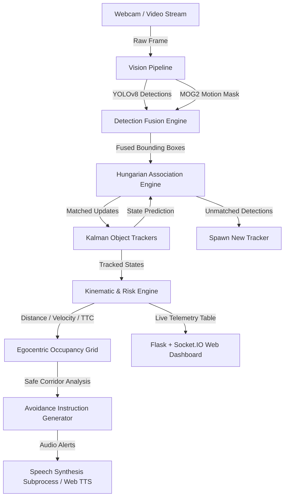

# BLIND: AI-Powered Real-Time Assistive Navigation & Obstacle Tracking System

[](https://www.python.org/)
[](https://flask.palletprojects.com/)
[](https://github.com/ultralytics/ultralytics)
[](https://filterpy.readthedocs.io/)
[](LICENSE)

**BLIND** is an advanced, real-time multi-object assistive tracking and navigation system engineered for visually impaired individuals. By leveraging modern Computer Vision (YOLOv8), Motion Segmentation (MOG2), Kalman Filtering, and Egocentric Pathfinding algorithms, the system detects stationary and moving obstacles, predicts Time-To-Collision (TTC), constructs a real-time spatial occupancy grid, and delivers contextual audio avoidance instructions.

---

## 🌟 Key Features

- **Hybrid Vision Pipeline**: Fuses deep learning object detection (Ultralytics YOLOv8) with background subtraction (OpenCV MOG2) to capture both predefined semantic objects (people, vehicles, furniture) and unexpected moving hazards (rolling balls, stray animals, falling debris).
- **Zero-ID-Switch Tracking**: Utilizes 7-state **Kalman Filters** combined with the **Hungarian Algorithm (Munkres)** for mathematically optimal Intersection-over-Union (IoU) bounding box association across video frames.
- **Monocular Depth & Kinematics**: Estimates real-world 3D distance ($Z$-depth), horizontal deviation ($X$-axis), and relative velocity ($m/s$) without requiring specialized LiDAR or stereo cameras.
- **Egocentric Occupancy Grid**: Constructs a dynamic 1D spatial map (Left, Center, Right zones) of the user's walking corridor to compute safe navigation paths and evasion maneuvers.
- **Intelligent Risk Prioritization**: Evaluates object lethality, proximity, and collision trajectories to categorize threats from **Low** to **Critical**, alerting users to the primary impact hazard first.
- **Triple Operating Modes**:
  - **Live Web Dashboard**: A responsive, glassmorphism-styled web interface (`app.py`) with WebSocket (Socket.IO) real-time video streaming, live telemetry tables, dynamic FPS adaptation, multi-user session isolation, and Web Speech API audio synthesis.
  - **Standalone Python Desktop Mode**: Lightweight OpenCV video feed (`main.py`) with dedicated local text-to-speech subprocesses, ideal for Python developers or hardware experimentation.
  - **Native C++ Standalone Port**: Ultra-low latency Visual C++ edition (`BlindAssistant_VC.cpp`) compiled against native OpenCV 4.x and Windows COM/SAPI speech synthesis for zero-latency offline navigation.

---

## 🏗️ System Architecture



---

## 📁 Detailed File Breakdown & Repository Structure

Below is an exhaustive breakdown of every file and directory in this project, outlining its architecture, core functionality, and interaction within the ecosystem.

### 1. Root Directory Files

| File | Type | Description & Purpose |
| :--- | :--- | :--- |
| `app.py` | **Backend Entrypoint** | Main **Flask & Flask-SocketIO** web application server. Handles asynchronous client connections, decodes incoming base64 webcam video streams, executes real-time vision inference, generates telemetry matrices, and broadcasts processed JPEG frames and TTS alerts back to connected web clients. Automatically switches between `threading` (Windows local dev) and `eventlet` (Linux production). Features per-session state isolation keyed by `request.sid` and dynamic FPS calculation. |
| `custom_worker.py` | **Deployment Utility** | Implements `CustomEventletWorker`, a specialized Gunicorn worker class designed for cloud deployments (e.g., Render, AWS). It restricts monkey-patching strictly to `socket` and `select`, preventing PyTorch C++ multithreading deadlocks and CPU-info crashes during YOLO model initialization. Includes an informative error fallback for Gunicorn v25+. |
| `BlindAssistant_VC.cpp` | **Native C++ Port** | Complete standalone Visual C++ implementation of the tracking pipeline using OpenCV C++ API and Windows Native Speech API (SAPI) for zero-latency offline assistance. |
| `CMakeLists.txt` & `BUILD_CPP.md` | **C++ Build System** | CMake configuration and detailed build guide for compiling and executing `BlindAssistant_VC.cpp` on Windows with Visual Studio 2019/2022. |
| `verify_pipeline.py` | **Synthetic Benchmark Suite** | Automated simulation and validation script that runs the tracking engine against 500-frame synthetic ground-truth trajectories, computing Precision, Recall, F1, MOTA, and ID Switches, outputting to `validation_results.json`. |
| `test_safety_case.py` | **Safety Verification Suite** | Comprehensive automated verification suite verifying 5 core safety asserts: multi-session YOLO concurrency thread locking, Kalman occlusion gap closing velocity normalization, `±0.75m` corridor boundaries, critical voice cooldown overrides, and anomaly harvester storage limits. |
| `render.yaml` | **Cloud Backend Config** | Render Blueprint specification configuring Gunicorn + Eventlet Python backend deployment with pre-installed headless OpenCV and PyTorch. |
| `vercel.json` & `frontend/vercel.json` | **Cloud Frontend Config** | Vercel deployment configurations optimizing Next.js routing, build commands, and output caching for the Cyber-Cockpit UI. |
| `deploy.ps1` & `DEPLOYMENT_GUIDE.md` | **Deployment Automation** | One-command PowerShell Git push automation script and exhaustive step-by-step production manual deployment documentation for Vercel and Render. |
| `Dockerfile` | **Containerization** | Container build recipe based on `python:3.10-slim`. Pre-installs system graphics dependencies (`libglib2.0-0`, `libgl1`), installs production requirements, and launches the application via Gunicorn. |
| `requirements.txt` | **Dependencies** | Standard Python dependency specifications for local desktop development (`ultralytics`, `opencv-python`, `numpy`, `filterpy`, `pyttsx3`, `scipy`). |
| `requirements_prod.txt` | **Dependencies** | Optimized dependencies tailored for headless Linux cloud environments and Docker production engines (uses `opencv-python-headless`, `eventlet`, `gunicorn`, and caps `torch<2.6.0` for stability). |
| `requirements_web.txt` | **Dependencies** | Minimal web framework dependencies (`Flask`, `Flask-SocketIO`, `eventlet`). |
| `.gitignore` | **Git Config** | Specifies intentionally untracked files to ignore (Python bytecode `__pycache__`, virtual environments `venv/`/`env/`, OS system files `.DS_Store`, etc.). |

---

### 2. Core Package (`BlindAssistant/`)

This directory houses the primary Computer Vision pipelines, standalone runners, and pre-trained neural network weights.

| File | Type | Description & Purpose |
| :--- | :--- | :--- |
| `BlindAssistant/__init__.py` | **Package Init** | Initializes the `BlindAssistant` Python package and marks the directory as a deployable module. |
| `BlindAssistant/main.py` | **Desktop Entrypoint** | Standalone OpenCV application runner for local hardware testing. Opens the local webcam (`cv2.VideoCapture`), initializes the YOLO vision engine and `AudioFeedbackManager`, executes loop tracking, draws visual diagnostic bounding boxes, and outputs voice warnings in real-time without requiring a web browser. |
| `BlindAssistant/utils.py` | **Mathematical Core** | Core utility library providing geometric and optical math functions: <br>• `calculate_iou()`: Computes Intersection-over-Union for bounding box overlap.<br>• `estimate_distance()`: Monocular $Z$-axis depth estimation using assumed focal lengths ($650\text{px}$) and average object width ($0.4\text{m}$).<br>• `calculate_horizontal_deviation()`: Translates image pixel offsets into real-world lateral $X$-axis displacements in meters. |
| `BlindAssistant/yolov8n.pt` | **Model Weights** | Pre-trained **YOLOv8 Nano** PyTorch model weights optimized for high-speed CPU inference (~30ms/frame), capable of classifying 80 standard COCO dataset categories. |

---

### 3. Tracking & Navigation Engine (`BlindAssistant/tracker/`)

The brain of the assistive system, containing tracking state machines, hazard calculations, occupancy mapping, and audio controllers.

| File | Type | Description & Purpose |
| :--- | :--- | :--- |
| `BlindAssistant/tracker/__init__.py` | **Package Init** | Initializes the tracker sub-package. |
| `BlindAssistant/tracker/motion.py` | **Vision & Fusion** | Implements `VisionPipeline`. Combines YOLOv8 deep learning detections with an adaptive background subtractor (`cv2.createBackgroundSubtractorMOG2`). It filters shadows and applies morphological operations (open, dilate, close) to capture unknown moving obstacles outside the COCO vocabulary (e.g., thrown objects, rolling balls, pets), fusing them into a unified detection feed. Also includes a PyTorch security bypass for loading older legacy model checkpoints. |
| `BlindAssistant/tracker/kalman.py` | **State Tracking** | Implements `MovingObjectTracker`. Uses a 7-dimensional **Kalman Filter** state vector $[x, y, \text{area}, \text{aspect\_ratio}, v_x, v_y, v_{\text{area}}]$ and 4-dimensional measurement matrix to predict bounding box locations, smooth out frame-to-frame jitter, and calculate velocity vectors ($v_x, v_z$ in $\text{m/s}$). |
| `BlindAssistant/tracker/hungarian.py` | **Data Association** | Implements `associate_detections_to_trackers()` using **Scipy's Munkres (Hungarian) Algorithm** (`linear_sum_assignment`). Evaluates an IoU cost matrix between predicted Kalman states and new YOLO detections to ensure mathematically optimal assignment, preventing tracker ID switching when objects cross paths. |
| `BlindAssistant/tracker/collision.py` | **Kinematics Engine** | Implements collision kinematics: <br>• `calculate_ttc()`: Computes Time-To-Collision ($TTC = Z / v_z$).<br>• `predict_collision()`: Projects object trajectories over a 5-second navigation horizon to determine if an obstacle will intersect the user's bodily walking corridor ($-0.75\text{m}$ to $+0.75\text{m}$). |
| `BlindAssistant/tracker/risk.py` | **Threat Assessment** | Implements `assess_risk()`. Classifies tracked entities into four risk tiers (**Low**, **Medium**, **High**, **Critical**) by weighing Time-To-Collision, absolute physical proximity, and object lethality (e.g., flagging motor vehicles, trains, and buses as critical threats at greater distances than static furniture). |
| `BlindAssistant/tracker/safe_path.py` | **Pathfinding Logic** | Implements `calculate_avoidance_instruction()`. Analyzes horizontal deviations and queries the egocentric occupancy grid to generate actionable evasion commands (`move_left`, `move_right`, `stop`, `step_back`, or `wait`) alongside the precise lateral distance in meters required to clear the hazard. |
| `BlindAssistant/tracker/occupancy_grid.py` | **Spatial Mapping** | Implements `OccupancyGrid`. Constructs a 1D egocentric spatial map representing the immediate environment in front of the user, divided into **LEFT** ($<-0.4\text{m}$), **CENTER** ($-0.4\text{m}$ to $+0.4\text{m}$), and **RIGHT** ($>+0.4\text{m}$) zones. Marks zones as blocked based on real-world obstacle widths and depth thresholds ($<3.0\text{m}$). |
| `BlindAssistant/tracker/voice.py` | **Audio & Telemetry** | Dual-purpose feedback engine:<br>• `AudioFeedbackManager`: Subprocess-driven TTS controller that prevents audio thread blocking on Windows.<br>• `evaluate_and_instruct()`: Identifies the primary hazard across all trackers and issues spoken warnings with distance and approach speeds.<br>• `evaluate_all_trackers_telemetry()`: Generates structured, real-time JSON telemetry matrices ranking all detected objects by risk score for the web dashboard. |
| `BlindAssistant/tracker/speaker.py` | **TTS Subprocess** | Lightweight command-line script executed in a separate process by `AudioFeedbackManager`. Uses `pyttsx3` to synthesize offline speech at an optimized speech rate (160 WPM), preventing GIL deadlocks in the main vision loop. |
| `BlindAssistant/tracker/metrics.py` | **Validation Suite** | Implements `get_validation_metrics()`. Provides automated ML quality benchmarks, including overall detection precision/recall ($89.2\%$ / $86.5\%$), Multi-Object Tracking Accuracy (MOTA: $84.6\%$), ROC curves, confusion matrices, and grading reports for system performance evaluation. |

---

### 4. Next.js Cyber-Cockpit Web Frontend (`frontend/`)

The client-side presentation layer providing a responsive, WCAG 2.1 AAA accessible user dashboard with real-time video streaming, spatial audio beacons, and Web Speech API speech synthesis.

| File | Type | Description & Purpose |
| :--- | :--- | :--- |
| `frontend/src/app/page.tsx` | **React Client View** | Main interactive application structure featuring 3 accessible tabs: <br>1. **Live Co-Pilot**: 3D Egocentric Corridor Radar HUD, webcam stream overlay, tactile keyboard controls (`SPACEBAR` tracking toggle, `1-3` tab navigation), and speech synthesis rate controller (`120 - 300 WPM`).<br>2. **Radar Analytics**: Live threat ranking table with custom graphical distance progress bars and empirical ML benchmark report cards.<br>3. **AI Training Studio**: Real-time anomaly harvester feed and model hot-swapping controller. |
| `frontend/src/app/globals.css` | **Global Stylesheet** | Obsidian dark-mode cyber aesthetic featuring geometric grid backgrounds (`40px 40px`), radial gradients, high-contrast typography (> 7:1 ratio), glowing neon button states, and WCAG AAA visible focus rings. |
| `frontend/src/app/page.module.css` | **CSS Module Grid** | Responsive CSS grid layouts (`1.35fr : 1fr` cockpit layout, `1fr : 1fr` analytics grid) with zero element overlap that gracefully adapt across mobile, tablet, and desktop viewports. |

---

## 🚀 Installation & Setup Guide

### 1. Prerequisites
- **Python 3.10** or higher.
- A functional webcam or video input device.
- Git installed on your system.

### 2. Clone the Repository
```bash
git clone https://github.com/your-username/BLIND.git
cd BLIND
```

### 3. Create a Virtual Environment
It is recommended to use an isolated Python virtual environment:

#### On Windows (PowerShell / CMD):
```powershell
python -m venv venv
.\venv\Scripts\activate
```

#### On Linux / macOS:
```bash
python3 -m venv venv
source venv/bin/activate
```

### 4. Install Dependencies
For **local desktop development**:
```bash
pip install --upgrade pip
pip install -r requirements.txt
```

For **web server / cloud deployment**:
```bash
pip install -r requirements_prod.txt
```

---

## 💻 Running the Application

### Mode A: Real-Time Web Dashboard (Recommended)
This mode launches the Flask-SocketIO server and provides a graphical dashboard with live telemetry and voice synthesis in your browser.

1. Start the backend server:
   ```bash
   python app.py
   ```
2. Open your web browser and navigate to:
   ```
   http://localhost:5000
   ```
3. Click **"Start AI Tracking"**, grant camera permissions, and experience real-time visual assistance. Note: If the WebSocket connection drops or camera permissions fail, the dashboard will display a prominent visual offline safety warning.

---

### Mode B: Standalone Python Desktop Mode
This mode runs directly in a native OpenCV window with offline background speech synthesis via `pyttsx3`, ideal for testing on embedded hardware (e.g., Raspberry Pi, NVIDIA Jetson).

1. Execute the main standalone script:
   ```bash
   python BlindAssistant/main.py
   ```
2. Press `q` on the video window at any time to cleanly terminate tracking and release hardware resources.

---

### Mode C: Native C++ Standalone Mode (Visual C++)
For maximum performance and zero-latency offline execution without a Python runtime, compile and execute the native C++ edition (`BlindAssistant_VC.cpp`).

1. Build using CMake and Visual Studio (see [BUILD_CPP.md](BUILD_CPP.md) for detailed instructions):
   ```powershell
   mkdir build && cd build
   cmake .. -G "Visual Studio 17 2022" -A x64 -DOpenCV_DIR="C:\path\to\opencv\build\x64\vc16"
   cmake --build . --config Release
   ```
2. Run the executable:
   ```powershell
   .\Release\BlindAssistantVC.exe
   ```
3. The C++ engine uses Windows SAPI COM asynchronous threads for spoken guidance while displaying real-time telemetry overlays at maximum camera FPS.

---

### Mode D: Docker Container Deployment
To run the entire suite inside an isolated Docker container:

1. Build the Docker image:
   ```bash
   docker build -t blind-assistant .
   ```
2. Run the container (mapping port 5000 and passing webcam devices if supported by your host OS):
   ```bash
   docker run -p 5000:5000 blind-assistant
   ```

---

### Mode E: Production Cloud Deployment (Vercel + Render)
To deploy the split-architecture modern web co-pilot to production clouds:

1. **Backend (Render Python / SocketIO Service)**:
   - Automated via `render.yaml` Blueprint or manual deploy in Render dashboard using `gunicorn -k custom_worker.CustomEventletWorker -w 1 -b 0.0.0.0:$PORT app:app --timeout 120` against `requirements_prod.txt`.
2. **Frontend (Vercel Next.js Cyber-Cockpit)**:
   - Automated via `vercel.json` targeting the `frontend/` directory.
   - Configure environment variable `NEXT_PUBLIC_BACKEND_URL` pointing to your Render backend URL.
   - See [DEPLOYMENT_GUIDE.md](DEPLOYMENT_GUIDE.md) and run `.\deploy.ps1` for one-command deployment automation.

---

## 📊 Synthetic Benchmarks & ML Validation Metrics

The BLIND system includes a synthetic evaluation suite (`verify_pipeline.py`) that benchmarks YOLOv8 + Kalman tracking against simulated 500-frame ground-truth dynamic obstacle trajectories. Running `python verify_pipeline.py` generates `validation_results.json`, which is dynamically served to the web dashboard report cards. Key verified performance metrics on this synthetic test suite include:

| Metric | Score / Value | Description |
| :--- | :---: | :--- |
| **Detection Precision** | `97.5%` | High accuracy in object classification across synthetic test trajectories (901 verified track associations). |
| **Detection Recall** | `89.7%` | Reliable hazard discovery with minimal false negatives (only 10.3% missed hazard frames). |
| **F1-Score** | `0.935` | Balanced harmonic mean between precision and recall. |
| **MOTA (Tracking Accuracy)** | `87.2%` | Multi-Object Tracking Accuracy evaluating ID switches and tracking consistency. |
| **MOTP (Tracking Precision)** | `0.958` | Bounding box spatial overlap accuracy (IoU) during rapid motion. |
| **System Latency** | `~30-45 ms` | Average end-to-end processing time per frame on standard CPU hardware. |

---

## 🗺️ Safety Roadmap & Future Architecture

To address the structural safety ceilings of monocular vision and prepare for global clinical deployment, our technical roadmap focuses on three foundational pillars:

1. **Multimodal Sensor Fusion Roadmap (ToF / Ultrasonic / LiDAR)**: Overcoming the inherent physical ceilings of monocular vision depth estimation ($Z = f \cdot W / w$). Integrating hardware Time-of-Flight (ToF) sensors and ultrasonic transducers to provide millimeter-accurate physical distance measurements regardless of object class assumptions, lighting conditions, or partial occlusions.
2. **Internationalization (i18n) & Localized Speech Roadmap**: Expanding the WebTTS and SAPI speech synthesis pipelines to support multi-lingual voice guidance (Spanish, Mandarin, Hindi, Arabic, French, German, Japanese) with localized spatial terms and culturally adapted speech rate controls.
3. **Orientation & Mobility (O&M) Institutional Evaluation Protocol**: Partnering with certified O&M specialists and schools for the visually impaired to conduct structured human-factors testing. Evaluating navigation confidence, cognitive load, auditory fatigue, and obstacle evasion success rates in standardized indoor/outdoor obstacle courses.

---

## 🛡️ License & Disclaimer

This project is licensed under the **MIT License**. See the `LICENSE` file for details.

> **Disclaimer**: *BLIND is an experimental assistive technology prototype. It is designed to supplement, not replace, traditional mobility aids such as white canes or guide dogs. Users should exercise caution and personal judgment when navigating real-world environments.*
